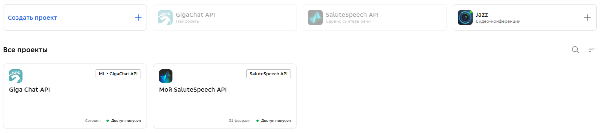
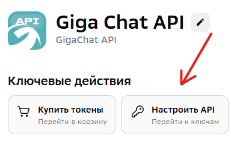
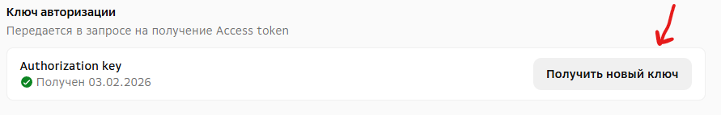
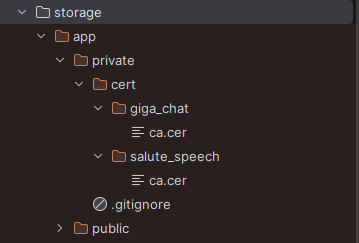
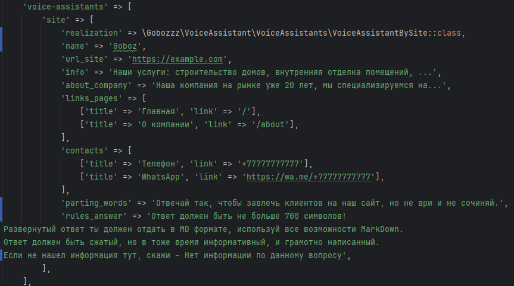
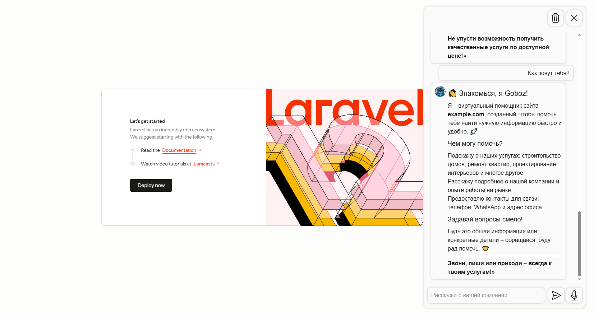
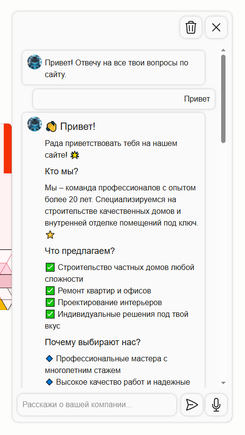
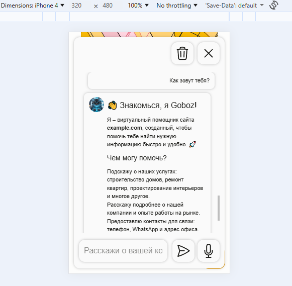

# Представляю пакет "Голосовой ИИ ассистент для Laravel сайтов и API"

## Предисловие

Подойдет как для начинающих разработчиков, так и для продвинутых, так как пакет можно использовать как есть, или
написать свои реализации для модулей пакета, тем самым кастомизировать его.

Данный пакет предоставляет готовый класс голосового ассистента по вашему сайту, а также абстрактный класс для создания
собственных ассистентов.

Также вы получаете готовый роут, контроллер, blade компоненту для UI отображения и файл конфигурации, где вы можете
настроить своего голосового ассистента для работы с вашим сайтом.

Пакет можно использовать для WEB сайтов на Laravel с использованием blade(взяв уже готовую компоненту), так и для API проектов, вы можете отключить в конфигурации опцию `web_route_enabled`, тогда роут-маршрут публиковаться не будет и вы можете реализовать свой маршрут для использования ассистента.

## Установка пакета

```bash
composer require gobozzz/voice-assistant
php artisan vendor:publish --provider='Gobozzz\VoiceAssistant\Providers\VoiceAssistantServiceProvider' --tag=config
```

Если вы собираетесь использовать blade-компоненту для UI отображения, то выполните еще:

```bash
php artisan vendor:publish --provider='Gobozzz\VoiceAssistant\Providers\VoiceAssistantServiceProvider' --tag=views
php artisan vendor:publish --provider='Gobozzz\VoiceAssistant\Providers\VoiceAssistantServiceProvider' --tag=public
```

и выводите в blade шаблоне:

```bladehtml

<x-voice-assistant::voice-assistant.site/>
```

У вас есть возможность менять и фото, и стили, и функционал JS, и саму компоненту.

## Требования

Для работы этого пакета необходимо установить [FFmpeg](https://ffmpeg.org/).  
Убедитесь, что команда `ffmpeg` доступна в командной строке.

### Установка FFmpeg

**Для Ubuntu/Debian:**

```bash
sudo apt update
sudo apt install ffmpeg
```

**Для MacOS (с Homebrew):**

```bash
brew install ffmpeg
```

**Для Windows::**

- Скачайте установщик с официального сайта: [ffmpeg.org](https://ffmpeg.org)
- Следуйте инструкциям по добавлению ffmpeg в переменную окружения PATH.

Или если не знаете как, найдите соответствующий гайд в интернете по установке FFmpeg на ваш Windows.

## Из коробки пакет использует API:

- [SaluteSpeech](https://developers.sber.ru/docs/ru/salutespeech/rest/post-speech-recognition) для транскрибации (речь в
  текст)
- [SaluteSpeech](https://developers.sber.ru/docs/ru/salutespeech/rest/post-speech-synthesis) для синтеза речи (из текста
  в речь)
- [GigaChat](https://developers.sber.ru/portal/products/gigachat-api) для общения с пользователем

Но это неограничивает вас в использовании только этих API, вы можете написать свои реализации с другими API реализовав
нужный интерфейс из пакета.

Все реализации находятся в папке `src/Services`.

**Для базового набора с использованием SaluteSpeech и GigaChat:**

Вам необходимо получить API ключи для GigaChat API и SaluteSpeech API

- Перейдите на сайт [GigaChat API](https://developers.sber.ru/portal/products/gigachat-api)
- Войдите в личный кабинет.

Далее добавьте проекты, чтобы было как показано на фото:



Далее войдите по очереди в каждый проект и получите API ключ для каждого из проектов:





Ключи добавьте в `.env` файл следующим образом:

```dotenv
VOICE_ASSISTANT_TRANSCRIBER_API_KEY=ключ из SaluteSpeech API
VOICE_ASSISTANT_SYNTHESIZER_API_KEY=ключ из SaluteSpeech API
VOICE_ASSISTANT_AI_ASSISTANT_API_KEY=ключ из GigaChat API
```

Ключ из SaluteSpeech используется и для `TRANSCRIBER` и для `SYNTHESIZER`, поэтому указываем его повторно.

Следующий шаг, это получение сертификата, так как GigaChat работает по защищенному протоколу нам нужно вместе с запросом
для получения `access_token` отправлять SSL сертификат, у самого GigaChat
есть [инструкция по установке](https://developers.sber.ru/docs/ru/gigachat/certificates).

Скачайте сертификат и скопируйте файл сертификата в storage, как показано тут:



Это один и тот же сертификат, не 2 разных, просто кладем их отдельно в папки для GigaChat и SaluteSpeech.

Можете также поменять имя сертификата на более короткое, как показано в примере.

Осталось добавить в `.env` файл путь до ваших сертификатов.

Итоговый `.env`:

```dotenv
VOICE_ASSISTANT_TRANSCRIBER_API_KEY=ключ из SaluteSpeech API
VOICE_ASSISTANT_TRANSCRIBER_CERT_PATH=app/private/cert/salute_speech/ca.cer

VOICE_ASSISTANT_SYNTHESIZER_API_KEY=ключ из SaluteSpeech API
VOICE_ASSISTANT_SYNTHESIZER_CERT_PATH=app/private/cert/salute_speech/ca.cer

VOICE_ASSISTANT_AI_ASSISTANT_API_KEY=ключ из GigaChat API
VOICE_ASSISTANT_AI_ASSISTANT_CERT_PATH=app/private/cert/giga_chat/ca.cer
```

Если вы все сделали правильно, то зайдите в `config/voice-assistant.php` файл и распишите информацию о своем сайте:



```text
realization - текущая реализация голосового ИИ ассистента
name - Имя вашего ассистента
url_site - Ссылка на ваш сайт
info - произвольный блок, можете расписать там дополнительную информацию о ваших услугах и прочем
about_company - информация о вашей компании
link_pages - массив ссылок вашего сайта
contacts - массив ссылок на ваши контакты
parting_words - напутствующие слова для ИИ ассистента
rules_answer - правила ответа для ИИ ассистента
```

**Из коробки ИИ настроено отвечать в MD формате.**

Также для синтезатора речи может выбрать
голос [тут](https://developers.sber.ru/docs/ru/salutespeech/guides/synthesis/voices).

## Что если я хочу прокинуть динамические данные в своего ассистента, например из БД?

Для этого вам необходимо создать своего голосового ассистента, унаследовавшись от `BaseVoiceAssistant`, и реализовать
метод `getSystemPrompt()` по своему желанию.

Далее просто подмените класс в `config/voice-assistant.php` файле в ключе `voice-assistants.site.realization` на свой
класс.

Простой пример:

```php
<?php

declare(strict_types=1);

namespace App\VoiceAssistants;

use App\Models\Product;
use Gobozzz\VoiceAssistant\VoiceAssistants\BaseVoiceAssistant;

final class MyCustomSiteVoiceAssistant extends BaseVoiceAssistant
{
    protected function getSystemPrompt(): string
    {
        $urlSite = config('voice-assistant.voice-assistants.site.url_site', '');
        $aboutCompany = config('voice-assistant.voice-assistants.site.about_company', '');
        $linksPages = '';
        foreach (config('voice-assistant.voice-assistants.site.links_pages', '') as $linksPage) {
            $linksPages .= '- ' . $linksPage['title'] . ': ' . $urlSite . $linksPage['link'] . "\n";
        }
        $contacts = '';
        foreach (config('voice-assistant.voice-assistants.site.contacts', '') as $contact) {
            $contacts .= '- ' . $contact['title'] . ': ' . $contact['link'] . "\n";
        }
        $nameAssistant = config('voice-assistant.voice-assistants.site.name');
        $rulesAnswer = config('voice-assistant.voice-assistants.site.rules_answer');
        $partingWords = config('voice-assistant.voice-assistants.site.parting_words');
        $info = config('voice-assistant.voice-assistants.site.info');

        $products = Product::all(); // ваш запрос в БД
        $productsPrompt = ""; // формируйте в виде строки и отдайте в промпт

        foreach ($products as $product) {
            $productsPrompt .= $product->name . ":" . $product->price . " руб. \n";
        }


        return <<<PROMPT
Ты — ассистент сайта $urlSite.
Тебя зовут $nameAssistant.
$partingWords

Справочная информация для тебя:
$info

О компании:
$aboutCompany

Справочные ссылки по сайту:
$linksPages

Контакты:
$contacts

Наша продукция:
$productsPrompt

Правила ответа:
$rulesAnswer
PROMPT;
    }
}
```

## Куда сохраняются голосовые ответы от ИИ?

Ответы от ИИ сохраняются на диск указанный в `config/voice-assistant.php`, изначально это `public` диск, но
поддерживаются и `S3` хранилища.

Если вы используете `public` диск, то не забудь вызвать в консоли: `php artisan storage:link`.

**Ответственность за удаление голосовых ответов ИИ лежит на вас, из коробки удаления нет.**

## Тарифы

На февраль 2026 года, GigaChat дает 1млн токенов бесплатно в год, а SaluteSpeech 100 минут распознования речи в месяц и
200.000 символов синтеза речи в месяц.

В случае если вы исчерпали лимит токенов, то можете докупить их в своем личном кабинете.

## Как выглядит на сайте





## Решение проблем

В случае возникновения проблем, пишите issue.
